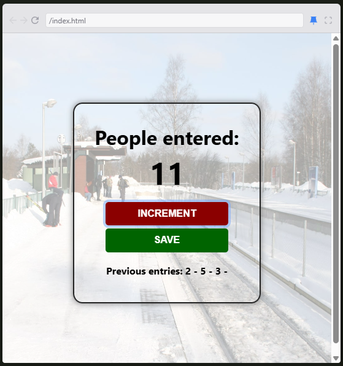

# 🔢 Counter App  
A simple yet powerful **Counter App** built with **HTML, CSS, and JavaScript**. This app allows you to **count, reset, and store previous counts**, displaying them in a **dash-separated format**. 🚀  

## ✨ Features  
- **Increment Count** – Increase the counter with a click.  
- **Reset Functionality** – Reset the count to start fresh.  
- **History Tracking** – Stores previous counts and displays them separated by dashes.  
- **Lightweight & Fast** – Built using pure HTML, CSS, and JavaScript.  

## 🛠️ Technologies Used  
- **HTML** – For structuring the app.  
- **CSS** – For styling and responsiveness.  
- **JavaScript** – For counter logic and history tracking.  

## 📸 Preview  
Here's how the **Counter App** looks:  
  

## 🚀 Getting Started  
1. **Clone the repository:**  
   ```bash
   git clone https://github.com/SaketXPrasad/counter-app.git  
   ```  
2. **Navigate into the project folder:**  
   ```bash
   cd counter-app  
   ```  
3. **Open the website in your browser:**  
   ```bash
   open index.html  
   ```  

## 🎨 Customization  
- Modify **styles in `style.css`** to change colors, fonts, or layout.  
- Adjust **counter behavior in `script.js`** to add more features.  

## 🌟 Future Enhancements  
- **Local Storage Support** – Save the count even after refreshing the page.  
- **Dark Mode** – Add a theme switcher for better accessibility.  
- **Animations & Sound Effects** – Improve user experience with subtle effects.  

## 🙌 Contributions  
Want to improve this project? Feel free to **fork**, **open issues**, or submit **pull requests**!  

## 📩 Contact  
**Project Maintainer:** Saket Prasad  
**Email:** saketxprasad@gmail.com  

🔢 **Thank you for using the Counter App! Hope it helps in your counting needs!** 🚀  
